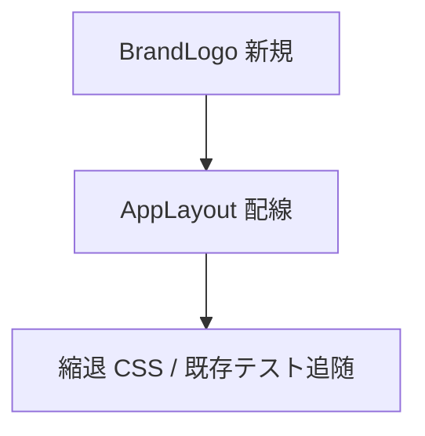

# _shared/app-shell 変更計画書（アプリタイトル左ロゴ + 幅不足時ロゴのみ）

> **入力**: `./001_REVISE_SPEC.md`, `../001__shared_app-shell_SPEC.md`, `src/components/AppLayout.tsx`, `public/favicon.svg`, `src/styles/theme.css`
> **最終更新**: 2026-06-13

---

## 1. 既存ファイル変更一覧

| ファイル | 変更内容（概要） | リスク | 関連 SPEC § |
|---|---|---|---|
| `src/components/AppLayout.tsx` | 先頭ホームリンクを「ロゴ + タイトル span」に置換。`aria-label` 付与 | 低 | §2.2, §7.1 |
| `src/styles/theme.css` | `.brand-link` / `.brand-name` のスタイル + 狭幅縮退（container query + media query fallback）追加 | 低 | §7.1 |
| `src/app/App.test.tsx`（必要時） | ヘッダのアプリ名取得を text→aria-label / ロール基準に調整 | 低 | §3 |

## 2. 新規ファイル一覧

| ファイル | 責務 | 依存 | LOC 見積 |
|---|---|---|---|
| `src/components/BrandLogo.tsx` | favicon モチーフのインライン SVG ブランドマーク（`aria-hidden`, size prop） | なし | ~25 |
| `src/components/BrandLogo.test.tsx` | SVG レンダリング + aria-hidden + size の単体テスト | vitest, RTL | ~20 |

## 3. 削除ファイル一覧

| ファイル | 削除理由 | 代替 |
|---|---|---|
| （なし） | — | — |

## 4. マイグレーション要否

- DB スキーマ変更: ❌
- 既存データ変換: ❌
- 設定ファイル変更: ❌
- ストレージパス変更: ❌
→ **マイグレーション不要**。

## 5. 実装 Phase 分割（`/flow:tdd` 連携）

### Phase 1 — BrandLogo コンポーネント（RED→GREEN→IMPROVE）
- 対象: `BrandLogo.tsx` + テスト
- ゴール: size 指定可・`aria-hidden="true"`・design-system 配色の SVG が描画される

### Phase 2 — AppLayout 配線 + 縮退 CSS
- 対象: `AppLayout.tsx`, `theme.css`, （必要時）`App.test.tsx`
- ゴール: ホームリンクがロゴ+タイトルになり、aria-label でアプリ名を保持。狭幅で `.brand-name` が非表示になる CSS が入る

## 6. 依存関係順序

## 7. ロールアウト計画

| ステップ | 内容 | 期日 | 検証方法 |
|---|---|---|---|
| 1 | 実装 + 単体 green | 2026-06-13 | vitest |
| 2 | `/flow:design` 視覚レビュー（広幅=ロゴ+名、狭幅=ロゴのみ） | 実装後 | headless スクショ |
| 3 | release バンドル同梱 | 次回 release | 実機目視 |

## 8. リスク・注意点

- container query 未対応ブラウザのフォールバック漏れ → media query を必ず併設。
- ロゴ追加によるレイアウトシフト → SVG に width/height 明示で抑制。
- 既存 `App.test.tsx` がアプリ名をテキスト一致で取得していると赤化 → aria-label / リンクロール基準に直す。

## 9. 完了の定義 (DoD)

- [ ] BrandLogo + AppLayout 実装、単体テスト green
- [ ] 狭幅でタイトル非表示・ロゴのみになる（視覚レビュー）
- [ ] aria-label でアプリ名が支援技術に提供される
- [ ] 既存 app-shell テストが green
- [ ] `/flow:design` 視覚レビュー通過

## 10. 更新履歴
| 日付 | 変更概要 | 実行者 |
|---|---|---|
| 2026-06-13 | 初版作成 | /flow:revise |
