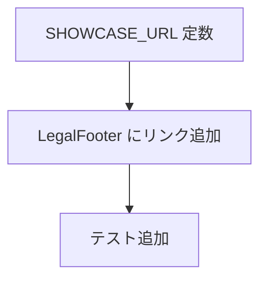

# _shared/app-shell 変更計画書（「他のアプリ」back-link 導線）

> **入力**: `./001_REVISE_SPEC.md`, `src/components/LegalFooter.tsx`, `src/components/AppLayout.tsx`
> **最終更新**: 2026-06-13

---

## 1. 既存ファイル変更一覧
| ファイル | 変更内容 | リスク | 関連 SPEC § |
|---|---|---|---|
| `src/components/LegalFooter.tsx` | footer に「他のアプリ」リンク section を追加（`SHOWCASE_URL`、外部リンク属性、aria-label） | 低 | §2.2, §7.2 |
| `src/components/LegalFooter.test.tsx`（あれば）/ `App.test.tsx` | 「他のアプリ」リンク存在 + href テスト追加 | 低 | §7.2 |

## 2. 新規ファイル一覧
| ファイル | 責務 | 依存 | LOC 見積 |
|---|---|---|---|
| `src/config/showcase.ts`（or 既存 config に追記） | `SHOWCASE_URL = "https://givers.work"` を 1 箇所集約 | なし | ~3 |

> 既に適切な config モジュールがあればそこに追記（新規ファイルを増やさない）。無ければ `src/config/showcase.ts` を新設。

## 3. 削除ファイル一覧
| ファイル | 削除理由 | 代替 |
|---|---|---|
| （なし） | — | — |

## 4. マイグレーション要否
- DB / データ変換 / 設定 / ストレージ: すべて ❌ → **不要**。

## 5. 実装 Phase 分割
### Phase 1（RED→GREEN→IMPROVE）
- 対象: `SHOWCASE_URL` 定数 + `LegalFooter` にリンク追加 + テスト
- ゴール: footer に「他のアプリ」リンクが存在し `https://givers.work` を新規タブで指す。既存 footer テスト green 維持

## 6. 依存関係順序

## 7. ロールアウト計画
| ステップ | 内容 | 期日 | 検証方法 |
|---|---|---|---|
| 1 | 実装 + 単体 green | 2026-06-13 | vitest |
| 2 | E2E（footer の「他のアプリ」到達性） | 実装後 | Playwright |
| 3 | release バンドル同梱 | 次回 release | 実機目視 |

## 8. リスク・注意点
- 外部リンクは `rel="noopener noreferrer"` 必須（tabnabbing 防止）。
- required_signals は実リンクテキスト「他のアプリ」。テキストを変えると O62 検出に影響（変える場合は perspectives と整合）。

## 9. 完了の定義 (DoD)
- [ ] footer に「他のアプリ」リンク、`SHOWCASE_URL` 集約、単体 green
- [ ] 外部リンク属性（target=_blank / rel=noopener noreferrer）
- [ ] E2E で footer リンク到達性 green
- [ ] 既存 app-shell テスト green

## 10. 更新履歴
| 日付 | 変更概要 | 実行者 |
|---|---|---|
| 2026-06-13 | 初版作成 | /flow:revise |
