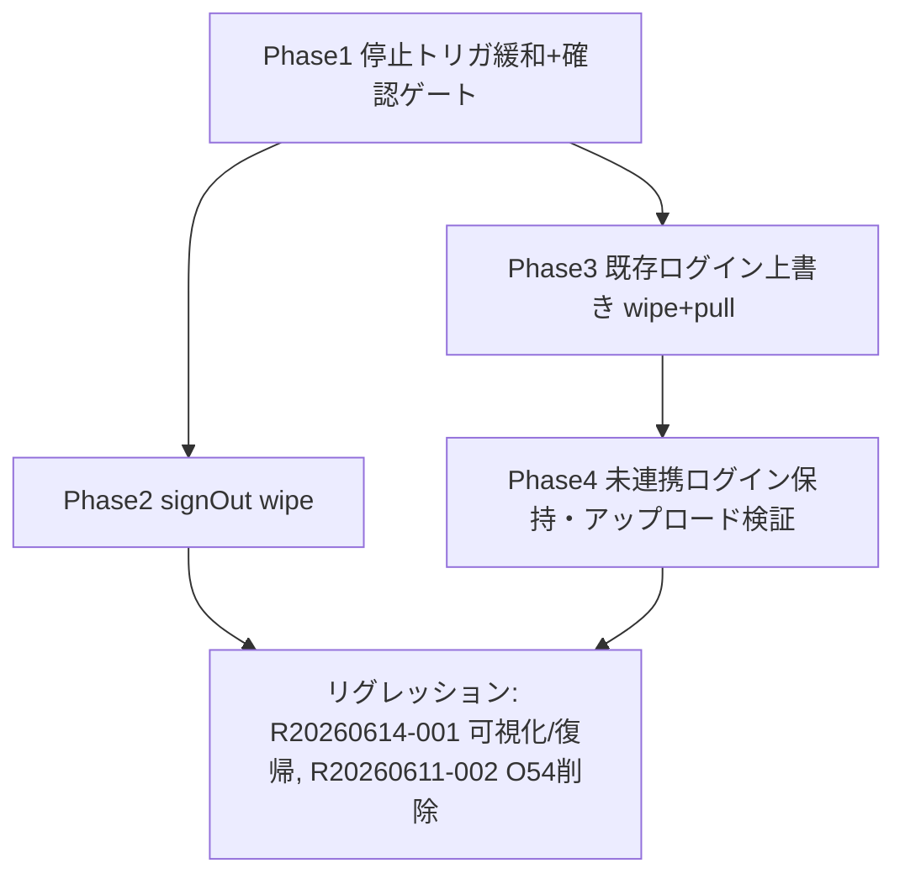

# _shared/auth 変更計画書（アカウント切替時の計時停止条件緩和 + デバイス⇔アカウント同期ポリシー）

> **入力**: `./001_REVISE_SPEC.md`, `../../../concept.md`, Step 2 で読んだ既存実装（App / AccountPage / AuthProvider / ownerContext / executionRepo / linkWithGoogle / dataOps / localStore / SetListPage）
> **最終更新**: 2026-06-15

---

## 0. 既存資産の再利用（重要）

- **`LocalStore.wipeOwner(ownerId)` は既に存在**（`src/services/sync/localStore.ts:146`、owner 配下のローカルエンティティ + outbox を物理削除、サーバ非干渉。`selfDelete.purgeAllData` が利用）。
  → 本改修の「サインアウト時デバイス削除 / 上書き時 wipe」は **新 API を追加せず `wipeOwner` を再利用**する（SPEC §7.2 の `clearLocalData` は `wipeOwner` を指す）。local-sync への API 追加は不要。
- **`ExecutionRepo.endInProgressNow(now)` も既存**（保存して終了、strict 達成）。呼び出し位置を `LoginEndGuard` から AccountPage の確認ゲートへ移すのみ。
- **C20260614-002 の linkGoogle / signInWithGoogle 自動分岐**（AuthProvider）が連携（保持）/ 既存サインイン（切替）の二経路を既に実装。本改修は wipe / 確認の配線を足すのみ。

## 1. 既存ファイル変更一覧

| ファイル | 変更内容（概要） | リスク | 関連 SPEC § |
|---|---|---|---|
| `src/App.tsx` | `LoginEndGuard`（224-232）と `<LoginEndGuard>` 配置（256）を撤去。`isLoginPath` import も execution 側で他用途なければ整理 | 中（停止契機の喪失を AccountPage 側で確実に代替する必要） | §2.1, §2.2 |
| `src/features/account/AccountPage.tsx` | `onLink` / `onSignOut` を「進行中確認 → 確認ダイアログ →（OK）停止保存 → アクション /（キャンセル）中止」に再構成。確認 UI は既存 `confirming` パターン踏襲。進行中検出 seam（props 注入）を追加 | 中 | §2.1, §2.2, §7.1, §7.2 |
| `src/components/auth/AuthProvider.tsx` | `signOut` に `clerk.signOut()` 後の `store.wipeOwner(ownerId)`（best-effort）を追加。signInWithGoogle fallback（既存データ持ちログイン）経路で旧 guest owner の `wipeOwner` → account データ pull（上書き）を配線 | 中（owner 解決タイミング・wipe 対象 owner の取り違え注意） | §2.2, §7.1, §7.2 |
| `src/services/auth/ownerContext.tsx` | 必要なら OwnerState に進行中確認/wipe 連携の seam を足す（または AccountPage に repos を直接配線）。最小化方針 | 低 | §2.2 |
| `src/App.tsx`（AccountPage 配線部 290-304） | AccountPage に進行中検出（`repos.execution.findInProgress`）と停止（`endInProgressNow`）を注入 | 低 | §7.2 |
| `_shared/local-sync` SPEC §6 | cross-owner replace ポリシー（アップロード/上書き/削除）が last-write-wins と直交である旨を追記（ドキュメントのみ） | 低 | §7.5 |

## 2. 新規ファイル一覧

| ファイル | 責務 | 依存 | LOC 見積 |
|---|---|---|---|
| （原則なし。既存 `wipeOwner` / `endInProgressNow` 再利用） | — | — | 0 |
| （必要時）`src/features/account/useAccountSwitch.ts` | 「進行中確認 → 確認 → 停止保存 → 切替」をまとめる薄い hook（AccountPage の肥大回避、任意） | executionRepo, ownerContext | ~40 |

## 3. 削除ファイル一覧

| ファイル | 削除理由 | 代替 |
|---|---|---|
| （ファイル削除なし） | — | — |
| `App.tsx` 内 `LoginEndGuard` コンポーネント（コード片） | path 起因の強制停止を廃止 | AccountPage の確認付き停止ゲート |
| `recovery.ts` `isLoginPath`（他に利用がなければ） | 停止契機が path 非依存になり不要化の可能性 | 利用箇所確認後に判断（残すなら無害） |

## 4. マイグレーション要否

- DB スキーマ変更: ❌
- 既存データ変換: ❌
- 設定ファイル変更: ❌
- ストレージパス変更: ❌
- → **`005_REVISE_MIGRATION.md` は生成しない**。サインアウト/上書き時のローカル wipe は runtime データ操作（owner スコープ・サーバ非干渉）であり migration ではない。

## 5. 実装 Phase 分割（`/flow:tdd-phase` 連携）

### Phase 1: 停止トリガの緩和 + 確認ゲート（RED→GREEN→IMPROVE）
- 対象: `App.tsx`（LoginEndGuard 撤去）, `AccountPage.tsx`（確認付き停止ゲート）, 配線
- ゴール: `/account` 閲覧では停止しない。ログイン/サインアウト押下時のみ、進行中があれば確認→OK で `endInProgressNow`（保存）→アクション、キャンセルで中止。
- テスト: 「閲覧では endInProgressNow が呼ばれない」「切替押下＋進行中で確認表示」「OK で停止保存→アクション」「キャンセルで未停止・未切替」。

### Phase 2: サインアウト時デバイス削除（要望6）
- 対象: `AuthProvider.tsx` signOut
- ゴール: `clerk.signOut()` 後に `wipeOwner(ownerId)`。サーバ非干渉。best-effort。
- テスト: signOut で wipeOwner が現 owner に対し呼ばれる / wipe 失敗でもサインアウト完了。

### Phase 3: 既存データ持ちログイン時の上書き（要望5）
- 対象: `AuthProvider.tsx` signInWithGoogle fallback
- ゴール: 既存ユーザー切替時に旧 guest owner を `wipeOwner` → account データ pull（デバイス上書き）。
- テスト: fallback 経路で旧 guest の wipeOwner が呼ばれる / 連携（新規）経路では wipe しない（保持）。

### Phase 4: 未連携ログイン時の保持・アップロード検証（要望4）
- 対象: linkGoogle（createExternalAccount 同一 userId）/ guest churn 抑止の回帰
- ゴール: 未連携ログインでデバイスデータが orphan 化せず保持・アップロードされる（消えない＝バグ要望3 の本丸）。
- テスト: 連携後も作成済みセット/活動が現 owner で getAllByOwner に残る / id 変更経路は reassignOwner で付け替え。

## 6. 依存関係順序

## 7. ロールアウト計画

| ステップ | 内容 | 期日 | 検証方法 |
|---|---|---|---|
| 1 | 実装 + 単体 green | tdd 完了時 | `/flow:tdd` 102 レポート |
| 2 | E2E green（緩和/確認/上書き/削除 + リグレッション） | e2e 完了時 | `/flow:e2e` 103 レポート（headless） |
| 3 | 視覚 + 文言確定（確認ダイアログ文言） | design/wording | `/flow:design` + `/flow:wording` |
| 4 | 実機 Clerk 経路確認 → デプロイ | release | `/flow:release`（実キー・実機スマホで login/signout/上書きを軽く確認） |

## 8. リスク・注意点

- **wipe 対象 owner の取り違え**: signOut は「現（連携済み）owner」、上書きは「旧 guest owner」を wipe。owner 解決タイミング（Clerk session 遷移中）に注意。Clerk セッション破棄前後で ownerId を確実に捕捉してから wipe する。
- **停止契機の取りこぼし**: LoginEndGuard 撤去後、AccountPage 以外から owner が切り替わる経路（例: 自動 signInWithGoogle fallback）でも進行中の保存が漏れないこと。確認は linkGoogle 押下時に済ませる設計（fallback はその後段）なので、押下ゲートで `endInProgressNow` を確実に通す。
- **データ消失バグ（要望3）の本丸**: 「作成済みセット・活動が消える」は強制停止そのものより **owner churn / orphan 化**が主因の可能性。Phase 4 で getAllByOwner ベースの保持を検証し、churn 抑止（C20260614-002 経路）を回帰で固定する。
- **未連携ゲストにサインアウト導線は出さない**（AccountPage は isLinked 時のみサインアウト表示）。未連携ゲストの誤 wipe を構造的に防止。

## 9. 完了の定義 (DoD)

- [ ] 全 Phase 完了
- [ ] `/account` 閲覧で計時が止まらない（path 停止撤去）
- [ ] ログイン/サインアウト押下＋進行中で確認ダイアログ。OK で保存停止、キャンセルで中止
- [ ] サインアウトでデバイスローカルが wipe され、サーバは無傷（再ログイン復元可）
- [ ] 既存データ持ちログインでデバイスが account データに上書きされる
- [ ] 未連携ログインで作成済みデータが消えず保持・アップロードされる
- [ ] 単体テストカバレッジ目標達成（既存継承 + 追加分）
- [ ] E2E シナリオ全成功（含むリグレッション: R20260614-001 / R20260611-002）
- [ ] `/flow:spec-review` 通過

## 10. 更新履歴
| 日付 | 変更概要 | 実行者 |
|---|---|---|
| 2026-06-15 | 初版作成 | /flow:revise |
