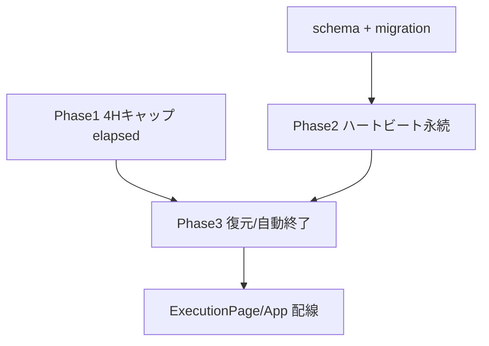

# execution 変更計画書（計時状態の永続化・復帰 + 4H放置キャップ）

> **入力**: `./001_REVISE_SPEC.md`, `../../concept.md`, Step 2 で読んだ既存実装
> **最終更新**: 2026-06-11

---

## 1. 既存ファイル変更一覧

| ファイル | 変更内容（概要） | リスク | 関連 SPEC § |
|---|---|---|---|
| `db/schema.ts` | `executionSessions` に `lastSavedAt: ts("last_saved_at")`（nullable）追加 | 低（additive） | §7.3 |
| `src/features/execution/model/elapsed.ts` | `MAX_ACTIVITY_SEC` 定数 + `cappedElapsedSec(...)` ヘルパ（`min(elapsedSec, MAX)`）追加 | 低 | §7.4 R1 |
| `src/features/execution/ExecutionPage.tsx` | `liveElapsed` を `cappedElapsedSec` 化。マウント復元の呼び出し（hydrate or 自動終了の反映）。毎秒/15秒ハートビート起動（既存1秒interval拡張） | 中（描画タイミング・フラッシュ防止） | §7.1, §7.4 |
| `src/features/execution/hooks/useExecution.ts` | 初期化時に `repo.restoreInProgress(sessionLocalId)` を読んで hydrate。`hydrate(state)` / `applyAt(fn, at)`（任意時刻適用、自動終了用）追加。heartbeat 書込 + 15秒 flush の起動 API | 中（init 副作用・状態整合） | §7.1 |
| `src/features/execution/model/executionRepo.ts` | `persist` の session レコードに `lastSavedAt` 追加。`restoreInProgress(sessionLocalId)`（IndexedDB findInProgress + localStorage ハートビート統合 → `{ state, lastSavedAt }`）追加。`saveHeartbeat`/`flushSession` 追加 | 中 | §7.1, §7.2 |
| `src/App.tsx` | `sessionLocalId` 採番は現状維持（`sess-<setId>-<date>` は日内安定で復元可能）。owner（`useOwner`）を ExecutionPage/heartbeat へ供給 | 低 | §7.5 |
| `src/hooks/useSync.ts` | （任意）15秒 flush を本フックに寄せるか、execution 側に持たせるか。最小差分は execution 側に持たせ本フックは不変 | 低 | §7.1 |
| `api/sync/*`（push handler） | session payload の `lastSavedAt` 透過。`DrizzleSyncRepo.upsert` は `{...payload}` 全列 upsert のため**コード変更ほぼ不要**（schema 列追加で自動反映）。型 `SyncEntity`/payload 型に lastSavedAt を許容 | 低 | §2.2 |

## 2. 新規ファイル一覧

| ファイル | 責務 | 依存 | LOC 見積 |
|---|---|---|---|
| `src/features/execution/model/heartbeat.ts` | localStorage ハートビート read/write（owner 別 namespace `hs:exec:hb:<ownerId>`、JSON encode/decode、owner 不一致破棄、clear） | localStorage, ExecState 型 | ~60 |
| `src/features/execution/model/recovery.ts` | 復元・自動終了の純粋ロジック: `decideRecovery({ state, lastSavedAt, now })` → `{ kind: 'resume' } | { kind: 'autoEnd', endedAt }`。4H 判定を関数化（テスト容易） | executionMachine, elapsed | ~50 |
| `db/migrations/0001_add_last_saved_at.sql` | `ALTER TABLE execution_sessions ADD COLUMN last_saved_at timestamptz;` | — | ~3 |

## 3. 削除ファイル一覧

| ファイル | 削除理由 | 代替 |
|---|---|---|
| （なし） | 削除なし | — |

## 4. マイグレーション要否

- DB スキーマ変更: ✅（`last_saved_at` 追加、詳細は `005_REVISE_MIGRATION.md`）
- 既存データ変換: ❌（既存行は NULL のまま、変換不要）
- 設定ファイル変更: ❌
- ストレージパス変更: ❌（localStorage 新規キーは追加のみ）

## 5. 実装 Phase 分割（`/flow:tdd-phase` 連携）

### Phase 1: 4H キャップ（R1）
- 対象: `elapsed.ts`（`MAX_ACTIVITY_SEC`, `cappedElapsedSec`）+ `ExecutionPage.liveElapsed` + 確定 `elapsedSec` 経路。
- ゴール: 1活動の表示・記録が 4H を超えない。境界（3:59:59 / 4:00:00 / 4:00:01）green。
- 独立性: 永続層に非依存で先行可能。

### Phase 2: ハートビート永続（毎秒 localStorage / 15秒 backend）
- 対象: `heartbeat.ts`（新規）+ `executionRepo`（lastSavedAt 付き persist / saveHeartbeat / flushSession）+ `schema.ts` + migration + `ExecutionPage` interval 拡張。
- ゴール: 計時中に毎秒 localStorage、15秒ごとに IndexedDB+outbox+push が走る。owner scope 検証。

### Phase 3: 復元 + 自動終了（R2）
- 対象: `recovery.ts`（新規 `decideRecovery`）+ `executionRepo.restoreInProgress` + `useExecution` hydrate/applyAt + `ExecutionPage` マウント配線。
- ゴール: リロードで計時継続復元（gap<4H）/ `lastSavedAt` で自動終了（gap>=4H）。フラッシュ無し。

## 6. 依存関係順序

## 7. ロールアウト計画

| ステップ | 内容 | 期日 | 検証方法 |
|---|---|---|---|
| 1 | migration `0001` を staging に適用 | 実装後 | `\d execution_sessions` で列確認、§005 検証クエリ |
| 2 | アプリを preview/staging にデプロイ | 実装後 | 計時→リロード復元 / 放置4H自動終了 のスモーク |
| 3 | 本番 migration 適用 + デプロイ | 検証後 | 本番スモーク（軽め） |

## 8. リスク・注意点

- **描画フラッシュ**: 復元判定をライブ描画前に確定しないと一瞬巨大な経過が見える。init で同期的に decideRecovery を済ませる。
- **毎秒 localStorage 書込**: 同期 API。snapshot は小サイズ（数アイテム）想定だが、JSON.stringify を毎秒。アイテム数増でも数KB なので許容。必要なら snapshot は 5秒、lastSavedAt のみ毎秒に分離可（[論点候補]、現状は毎秒で要望通り）。
- **owner 切替の取りこぼし**: localStorage namespace と IndexedDB getAllByOwner の両方で owner 一致を厳格化。
- **15秒 push の二重送信**: outbox 冪等（clientLocalId）で安全。push 失敗は握って outbox 保持。
- **background throttle**: 非前景では毎秒/15秒が保証されない（仕様上 OK、R2 が吸収）。

## 9. 完了の定義 (DoD)

- [ ] Phase 1-3 完了
- [ ] 単体テストカバレッジ目標達成（既存継承 + 新規）
- [ ] E2E: 計時→リロード復元 / 放置4H自動終了 / アカウント分離 が green（含むリグレッション）
- [ ] migration 検証完了（staging）
- [ ] `/flow:spec-review` 通過
- [ ] i18n 準拠スキャン（編集ファイルにハードコード自然言語の混入なし）

## 10. 更新履歴
| 日付 | 変更概要 | 実行者 |
|---|---|---|
| 2026-06-11 | 初版作成 | /flow:revise |
