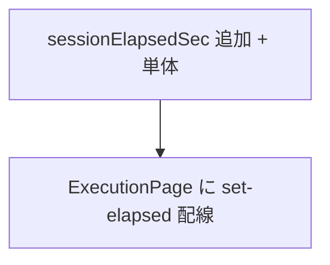

# execution 変更計画書（セット全体の経過時間を計時画面に表示）

> **入力**: `./001_REVISE_SPEC.md`, `src/features/execution/ExecutionPage.tsx`, `model/elapsed.ts`, `model/executionMachine.ts`, `src/services/time/localDate.ts`
> **最終更新**: 2026-06-13

---

## 1. 既存ファイル変更一覧

| ファイル | 変更内容（概要） | リスク | 関連 SPEC § |
|---|---|---|---|
| `src/features/execution/ExecutionPage.tsx` | 計時中セクションに `set-elapsed`（`formatDuration(sessionElapsedSec(s, nowIso))`）を追加。`formatDuration` import | 低 | §2.2, §7.1 |
| `src/features/execution/model/elapsed.ts` | `sessionElapsedSec(state, nowIso)` を追加（各 record に `cappedElapsedSec`/保存 elapsedSec を適用して合計） | 低 | §7.2 |
| `src/features/execution/model/elapsed.test.ts` | `sessionElapsedSec` の単体テスト追加 | 低 | §7.2 |
| `src/features/execution/ExecutionPage.test.tsx` | `set-elapsed` 表示の追加テスト | 低 | §2.2 |

## 2. 新規ファイル一覧
| ファイル | 責務 | 依存 | LOC 見積 |
|---|---|---|---|
| （新規ファイルなし） | `sessionElapsedSec` は `elapsed.ts` に追加 | — | ~15 |

## 3. 削除ファイル一覧
| ファイル | 削除理由 | 代替 |
|---|---|---|
| （なし） | — | — |

## 4. マイグレーション要否
- DB スキーマ変更: ❌ / 既存データ変換: ❌ / 設定ファイル変更: ❌ / ストレージパス変更: ❌
→ **マイグレーション不要**。

## 5. 実装 Phase 分割（`/flow:tdd` 連携）

### Phase 1 — `sessionElapsedSec` 純関数（RED→GREEN→IMPROVE）
- 対象: `elapsed.ts`, `elapsed.test.ts`
- ゴール: 終了済み record は保存 `elapsedSec`、進行中は live（running=now差分 / paused=pause時点凍結）を合計。負値 0 クランプ・各 record 4H 上限を適用

### Phase 2 — 計時画面に合計表示を配線
- 対象: `ExecutionPage.tsx`, `ExecutionPage.test.tsx`
- ゴール: 計時中に `set-elapsed` が表示され、tick で 1 秒ごと更新。done では非表示

## 6. 依存関係順序

## 7. ロールアウト計画
| ステップ | 内容 | 期日 | 検証方法 |
|---|---|---|---|
| 1 | 実装 + 単体 green | 2026-06-13 | vitest |
| 2 | `/flow:design` 視覚レビュー + `/flow:wording` 文言確定 | 実装後 | headless スクショ |
| 3 | release バンドル同梱 | 次回 release | 実機目視（複数活動で合計増加を確認） |

## 8. リスク・注意点
- 進行中 record の live 算出を `liveElapsed` と二重実装しないこと（`sessionElapsedSec` 内で `cappedElapsedSec` を共用し、ExecutionPage の `liveElapsed` とロジック整合）。
- paused 中は合計が増えない（進行中分が凍結）ことを期待挙動として明示。
- 合計と現在アイテム経過の表示が紛らわしくならないようラベルを明確化（wording）。

## 9. 完了の定義 (DoD)
- [ ] `sessionElapsedSec` 単体 green（終了済み+進行中、paused 凍結、巻き戻しクランプ）
- [ ] 計時画面に `set-elapsed` 表示、tick 更新を確認
- [ ] 既存 execution テスト（machine/elapsed/recovery/heartbeat）が green
- [ ] `/flow:design` 視覚レビュー + `/flow:wording` 文言確定

## 10. 更新履歴
| 日付 | 変更概要 | 実行者 |
|---|---|---|
| 2026-06-13 | 初版作成 | /flow:revise |
