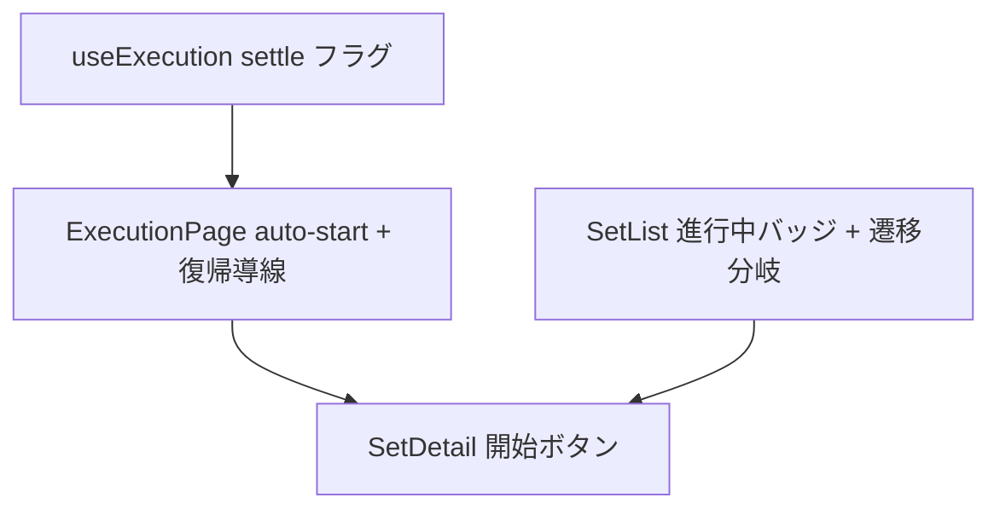

# execution 変更計画書（計時中セッションの可視化と導線確立）

> **入力**: `./001_REVISE_SPEC.md`, `src/App.tsx`, `src/features/execution/ExecutionPage.tsx`, `src/features/execution/hooks/useExecution.ts`, `src/features/execution/model/executionRepo.ts`, `src/features/activity-sets/SetListPage.tsx`
> **最終更新**: 2026-06-14

---

## 1. 既存ファイル変更一覧

| ファイル | 変更内容（概要） | リスク | 関連 SPEC § |
|---|---|---|---|
| `src/features/execution/hooks/useExecution.ts` | 復元 settle 済みフラグ（`settled`）と進行中 setId（`inProgressSetId`）を戻り値に追加。復元 effect の async 完了時に `settled=true` をセット（found 有無に関わらず）。`appliedRef` / 冪等 put の StrictMode 安全性は維持 | 中 | §2.2, §7.1, §7.2 |
| `src/features/execution/ExecutionPage.tsx` | 99-117 の中間「開始」ゲートを撤去。settle 前=読み込み表示、`settled && !s` かつ進行中なし=auto-start（1 回）、別セット進行中=復帰導線セクション（`『{name}』が進行中です` + `/run/{id}` リンク）を描画 | 高 | §2.2, §7.1, §7.4 |
| `src/App.tsx` | SetDetailRoute (74-88): 「実行する」`Link` を「開始」ボタン（`navigate(/run/:id)`）へ置換。SetsRoute (64-72): `repos.execution.findInProgress()` を取得し `inProgressSetId` を `SetListPage` に渡す。`onOpenSet` を進行中セットなら `/run/:id`、他は `/sets/:id` へ分岐。別セット進行中の復帰に必要な進行中セット名を ExecutionPage が引けるよう（または props 経由で）配線 | 中 | §2.2, §7.1, §7.2 |
| `src/features/activity-sets/SetListPage.tsx` | `SetListPageProps` に `inProgressSetId?: string` 追加。セット行（72-78）で `inProgressSetId === s.id` のとき「進行中」バッジ（`data-testid="in-progress-badge"`）を描画 | 中 | §2.2, §7.1, §7.2 |
| `src/features/execution/ExecutionPage.test.tsx` | 中間「開始」ゲート前提テストを auto-start 前提に更新 + 別セット進行中の復帰導線テスト追加 | 中 | §3 修正テスト |
| `src/features/activity-sets/SetListPage.test.tsx`（無ければ新規） | 進行中バッジ・遷移分岐テスト追加 | 低 | §1 追加テスト |

## 2. 新規ファイル一覧
| ファイル | 責務 | 依存 | LOC 見積 |
|---|---|---|---|
| （アプリ本体は新規ファイルなし） | 既存ファイルの prop/分岐追加で完結 | — | — |
| `src/features/activity-sets/SetListPage.test.tsx`（既存に無ければ） | 進行中バッジ・遷移分岐の単体 | RTL | ~40 |

## 3. 削除ファイル一覧
| ファイル | 削除理由 | 代替 |
|---|---|---|
| （なし）。`ExecutionPage` の中間「開始」ゲート分岐（99-117）はコード削除だがファイル削除ではない | — | auto-start ロジックに置換 |

## 4. マイグレーション要否
- DB スキーマ変更: ❌ / 既存データ変換: ❌ / 設定ファイル変更: ❌ / ストレージパス変更: ❌
→ **マイグレーション不要**（永続データ形状・`ExecState` 形状とも不変）。

## 5. 実装 Phase 分割（`/flow:tdd` 連携）

### Phase 1 — `useExecution` の settle フラグ公開（RED→GREEN→IMPROVE）
- 対象: `useExecution.ts`, `useExecution.test.ts`（あれば）
- ゴール: 復元 async 完了時に `settled=true`、`inProgressSetId` を公開。found 無し時も settle する。StrictMode 二重マウント安全（既存 `appliedRef` 維持）。

### Phase 2 — `ExecutionPage` の中間ゲート撤去 + auto-start + 別セット復帰導線
- 対象: `ExecutionPage.tsx`, `ExecutionPage.test.tsx`
- ゴール: `settled && !s`（進行中なし）で当該セットを fresh auto-start（1 回）。同セット進行中は復元再開。別セット進行中は復帰導線セクション表示。既存「開始」ゲートテストを更新。

### Phase 3 — 一覧バッジ + 遷移分岐（SetListPage / SetsRoute）
- 対象: `SetListPage.tsx`, `SetListPage.test.tsx`, `App.tsx`(SetsRoute)
- ゴール: 進行中セット行にバッジ。進行中セット選択で `/run/:id`、他は `/sets/:id`。

### Phase 4 — セット詳細「開始」ボタン化
- 対象: `App.tsx`(SetDetailRoute)
- ゴール: 「実行する」→「開始」ボタン（`/run/:id` 遷移）。中間ページを介さず計時へ。

## 6. 依存関係順序

## 7. ロールアウト計画
| ステップ | 内容 | 期日 | 検証方法 |
|---|---|---|---|
| 1 | Phase 1-4 実装 + 単体 green | 2026-06-14 | vitest |
| 2 | E2E（詳細→開始→活動 / 計時中一覧→進行中→復帰 / 別セット二重開始禁止） | 実装後 | E2E |
| 3 | `/flow:design` 視覚レビュー + `/flow:wording` 文言確定（バッジ/復帰導線文言） | 実装後 | headless スクショ |
| 4 | release バンドル同梱（一括） | 次回 release | 実機目視（幽霊セッション復帰・停止が可能なこと） |

## 8. リスク・注意点
- **二重開始防止の取りこぼし**: auto-start を「settle 完了 + 進行中なし」に厳密 gate しないと、復元と auto-start が競合して二重 session を作る恐れ。`settled` 判定 + `appliedRef` + start の冪等 put で 1 回限りを担保すること。
- **StrictMode 二重マウント**: 既存復元 effect の cancelled/`appliedRef` パターンを壊さない。settle フラグも cancelled 後はセットしない。
- **進行中セット名の解決**: 別セット進行中の復帰導線で表示する「セット名」は setId からセット一覧を引いて解決（ExecutionPage は単一セット名しか持たないため、進行中 setId 用の名前を別途取得 or props で渡す）。
- **一覧バッジの鮮度**: `findInProgress` は一覧描画時に取得。計時を別タブで終えた等の stale は許容（next render で解消）。

## 9. 完了の定義 (DoD)
- [ ] `useExecution` が `settled` / `inProgressSetId` を公開、復元 settle 後に立つ（found 有無問わず）
- [ ] `ExecutionPage` 中間ゲート撤去、進行中なし→auto-start（1 回）、同セット→再開、別セット→復帰導線
- [ ] `SetListPage` に進行中バッジ、進行中セット選択で `/run/:id` 分岐
- [ ] `SetDetailRoute` が「開始」ボタンで `/run/:id` 遷移
- [ ] 中間「開始」ゲート前提の既存テストを auto-start 前提へ更新し green
- [ ] 既存 execution テスト（machine/elapsed/recovery/heartbeat/repo）が全 green
- [ ] E2E: 詳細→開始→活動 / 計時中一覧→進行中→復帰 が green
- [ ] `/flow:design` + `/flow:wording` 反映

## 10. 更新履歴
| 日付 | 変更概要 | 実行者 |
|---|---|---|
| 2026-06-14 | 初版作成 | /flow:revise |
