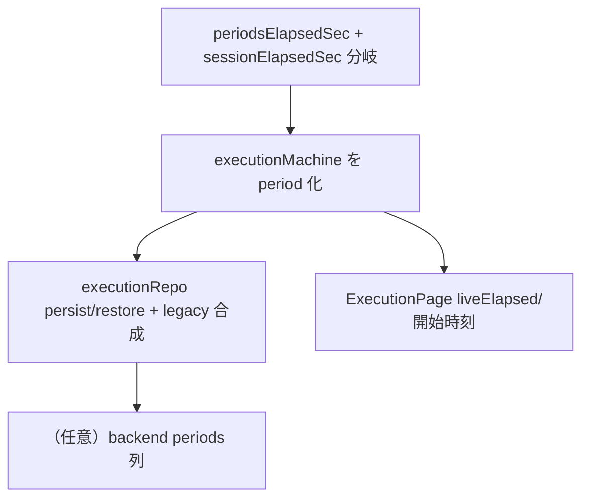

# execution 変更計画書（活動を 1:N period モデルにして中断時間を経過から除外）

> **入力**: `./001_REVISE_SPEC.md`, `src/features/execution/model/executionMachine.ts`, `model/elapsed.ts`, `model/executionRepo.ts`, `ExecutionPage.tsx`, 各 test, `db/schema.ts`
> **origin**: claim C20260614-001
> **最終更新**: 2026-06-14

---

## 1. 既存ファイル変更一覧

| ファイル | 変更内容（概要） | リスク | 関連 SPEC § |
|---|---|---|---|
| `src/features/execution/model/executionMachine.ts` | `ItemExec.periods` 追加。`newRec`（開いた period 1 本で初期化）、`pause`（末尾 period を now で閉じる）、`resumeSame`（新 period push）、`endCurrentItem`（開いた period があれば閉じ・elapsedSec を periods 合計で確定・endedAt 派生更新）、`nextItem`/`endSession`/`startSession` を period 操作に変更 | 高 | §2.1, §2.3, §7.1, §7.3 |
| `src/features/execution/model/elapsed.ts` | `periodsElapsedSec(periods, openEnd)` 追加。`sessionElapsedSec` を periods 優先・従来式フォールバックに分岐。既存 `elapsedSec`/`cappedElapsedSec`/`diffSec` は維持 | 中 | §7.2 |
| `src/features/execution/model/executionRepo.ts` | `persist` で record に `periods` を保存。`restoreInProgress` で `periods` 復元 + 欠落 legacy は `[{startedAt, endedAt}]` を合成 | 中 | §2.2, §4 |
| `src/features/execution/ExecutionPage.tsx` | `liveElapsed` を periods ベース（running=openEnd:now, paused=末尾閉済で凍結）に。開始時刻表示を `periods[0].startedAt` に変更 | 中 | §2.1, §7.1 |
| `src/features/execution/model/executionMachine.test.ts` | N3（pausedTotalSec 断定）を periods 断定に更新 + trailing-pause 除外/多重 pause-resume を追加 | 中 | §2.1 |
| `src/features/execution/model/elapsed.test.ts` | `periodsElapsedSec` の単体追加、`sessionElapsedSec` の periods 経路追加 | 低 | §7.2 |
| `src/features/execution/ExecutionPage.test.tsx` | 開始時刻=periods[0]、pause→次活動で経過が増えない表示テストを追加 | 低 | §2.1 |
| `src/features/execution/model/executionRepo.test.ts` | periods の persist/restore round-trip + legacy 合成テストを追加 | 低 | §4 |
| `db/schema.ts`（任意） | `executionRecords` に `periods: jsonb("periods")`（nullable）を additive 追加 | 低 | §2.3（任意） |

## 2. 新規ファイル一覧
| ファイル | 責務 | 依存 | LOC 見積 |
|---|---|---|---|
| （新規ファイルなし） | `periodsElapsedSec` は `elapsed.ts` に追加 | `diffSec` / `MAX_ACTIVITY_SEC` | ~20 |

## 3. 削除ファイル一覧
| ファイル | 削除理由 | 代替 |
|---|---|---|
| （なし） | `pausedTotalSec` は互換のため残置（vestigial） | periods が経過の SoT |

## 4. マイグレーション要否
- DB スキーマ変更: ⚠️ **任意**（backend `execution_records.periods jsonb` の additive 追加。IndexedDB が構造正本のため未追加でも可）
- 既存データ変換: ❌（移行不要。periods 欠落レコードは読み取り時に `[{startedAt, endedAt}]` を合成、保存済み `elapsedSec` を信頼）
- 設定ファイル変更: ❌ / ストレージパス変更: ❌
→ 詳細は `./005_REVISE_MIGRATION.md`。**必須マイグレーションなし**（任意・additive・オンライン）。

## 5. 実装 Phase 分割（`/flow:tdd` 連携）

### Phase 1 — `periodsElapsedSec` 純関数（RED→GREEN→IMPROVE）
- 対象: `elapsed.ts`, `elapsed.test.ts`
- ゴール: `Σ diffSec(p.startedAt, p.endedAt ?? openEnd)` を 4H 上限クランプ。開いた period 無し（paused）は openEnd を使わず確定区間のみ合算。`sessionElapsedSec` を periods 優先・従来式フォールバックに分岐。

### Phase 2 — executionMachine を period モデルへ
- 対象: `executionMachine.ts`, `executionMachine.test.ts`
- ゴール: `newRec`/`pause`/`resumeSame`/`endCurrentItem`/`nextItem`/`endSession`/`startSession` を period 操作に変更。`endCurrentItem` は `elapsedSec = periodsElapsedSec(periods, now)` を確定し `endedAt` を派生更新。**pause したまま next/end で中断区間が除外される**（trailing-pause テスト green）。

### Phase 3 — 永続・復帰（periods の persist/restore + legacy 合成）
- 対象: `executionRepo.ts`, `executionRepo.test.ts`
- ゴール: persist で `periods` を保存、restore で復元。periods 欠落 legacy は `[{startedAt, endedAt}]` を合成。round-trip で periods が損失なく往復。

### Phase 4 — 計時画面の配線（liveElapsed + 開始時刻）
- 対象: `ExecutionPage.tsx`, `ExecutionPage.test.tsx`
- ゴール: `liveElapsed` を periods ベースに、開始時刻表示を `periods[0].startedAt` に。pause→次活動で現アイテム経過が中断分を含まないことを表示で確認。

### Phase 5 —（任意）backend periods 列
- 対象: `db/schema.ts` + drizzle migration
- ゴール: `periods jsonb` を additive 追加（IndexedDB 正本のため任意。`/flow:release` 時に判断）。

## 6. 依存関係順序

## 7. ロールアウト計画
| ステップ | 内容 | 期日 | 検証方法 |
|---|---|---|---|
| 1 | 実装 + 単体 green（Phase 1-4） | 2026-06-14 | vitest |
| 2 | `/flow:e2e`（pause→次活動で中断除外） | 実装後 | headless E2E |
| 3 | `/flow:release` 実機目視（複数中断・4H cap） | 次回 release | 実機 |
| 4 | （任意）backend periods 列を staging→本番 | 任意 | drizzle migration |

## 8. リスク・注意点
- `liveElapsed`（ExecutionPage）と `periodsElapsedSec`（elapsed.ts）を二重実装しないこと（同一関数を共用しロジック整合）。
- `endCurrentItem` の冪等性: 既に endedAt あり（開いた period 無し）の場合は no-op を維持。
- 不変条件「開いた period は同時に高々 1 本」を pause/resume の双方で保つ。
- legacy 復元時に periods を合成した record は、保存済み `elapsedSec` を信頼し再計算で書き換えない（履歴の遡及補正をしない）。
- `pausedTotalSec` は残置するが経過計算に使わない（混在事故を避けるため periods があれば必ず periods 経路）。

## 9. 完了の定義 (DoD)
- [ ] `periodsElapsedSec` 単体 green（多重区間・4H 上限・巻き戻し 0 クランプ）
- [ ] executionMachine: pause→next/end で中断区間が経過に入らない（trailing-pause）、多重 pause/resume が正しく合算
- [ ] N3 等の既存テストを periods 断定に更新して green
- [ ] `executionRepo` periods round-trip + legacy 合成 green
- [ ] `ExecutionPage` 開始時刻=periods[0]、pause→次活動の経過が中断分を含まない
- [ ] 既存 execution テスト（recovery/heartbeat/summary）が green、振り返り合計が改修前後で不変
- [ ] `/flow:e2e` green

## 10. 更新履歴
| 日付 | 変更概要 | 実行者 |
|---|---|---|
| 2026-06-14 | 初版作成（claim C20260614-001 起点） | /flow:revise |
