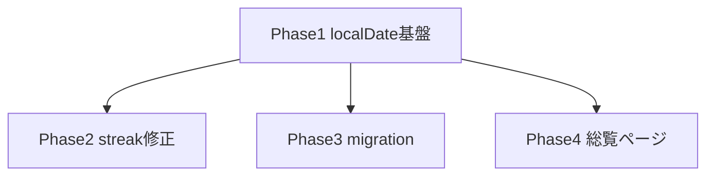

# streak-summary 変更計画書（振り返り総覧 + 連続日数の正確化）

> **入力**: `./001_REVISE_SPEC.md`, `../../concept.md` §1.4, Step 2 Read（streak-summary 一式 / executionRepo / App.tsx / AppLayout / localStore）
> **最終更新**: 2026-06-13

---

## 1. 既存ファイル変更一覧

| ファイル | 変更内容（概要） | リスク | 関連 SPEC § |
|---|---|---|---|
| `src/features/execution/model/executionRepo.ts` | `localDate()` を新 util `localDateOf()` 委譲に修正（UTC slice → ローカル TZ）。API 形不変 | 中（達成日記録の意味が変わる → migration で吸収） | §2.2 |
| `src/features/streak-summary/model/summarize.ts` | currentStreak: 最終日のみ未達許容（today-pending）ロジック追加 | 低（純関数、テスト先行） | §7.1 |
| `src/features/streak-summary/SummaryPage.tsx` | `todayStr` を `localDateOf(new Date())` に変更 | 低 | §2.2 |
| `src/features/streak-summary/model/summaryRepo.ts` | `getSetTotals()` 追加（session×record join、setId/itemId 別 elapsedSec 合算） | 低（additive） | §7.2 |
| `src/App.tsx` | `/summary` ルートを `SummaryOverviewRoute` に差し替え。`sessionLocalId` の日付スタンプをローカル日付化 | 低 | §2.1 |
| `src/app/repos.ts` | 初期化時に achievement 再構築 migration を 1 回実行（バージョンフラグ判定） | 中（初回ロードに 1 パス集計が入る） | §4 |

## 2. 新規ファイル一覧

| ファイル | 責務 | 依存 | LOC 見積 |
|---|---|---|---|
| `src/services/time/localDate.ts` | `localDateOf(d: Date): string`（ローカル TZ YYYY-MM-DD）+ 時間表示 `formatDuration(sec)` | なし | ~30 |
| `src/features/streak-summary/model/overview.ts` | 集計純関数: records+sessions → SetTotal[]（テスト容易化のため repo から分離） | types | ~50 |
| `src/features/streak-summary/SummaryOverviewPage.tsx` | 総覧ページ（ドロップダウン遷移 + details 一覧 + 合計時間） | setsRepo, summaryRepo, react-router | ~120 |
| `src/services/sync/migrations/rebuildAchievements.ts` | daily_achievement のローカル日付再構築（冪等、バージョンフラグ） | localStore, localDateOf | ~80 |
| 各 `.test.ts(x)` | 003_REVISE_UNIT_TEST 参照 | vitest | ~250 |

## 3. 削除ファイル一覧

なし。

## 4. マイグレーション要否

- DB スキーマ変更: ❌
- 既存データ変換: ✅（ローカル IndexedDB の daily_achievement 再構築 → 005_REVISE_MIGRATION.md）
- 設定ファイル変更: ❌
- ストレージパス変更: ❌

## 5. 実装 Phase 分割（`/flow:tdd-phase` 連携）

### Phase 1: 日付是正の基盤（RED→GREEN→IMPROVE）
- 対象: `localDate.ts`（新規）、`executionRepo.localDate` 委譲、`SummaryPage.todayStr`、`App.tsx sessionLocalId`
- ゴール: 達成日・today がローカル TZ で一致。既存テスト green 維持

### Phase 2: streak 計算修正
- 対象: `summarize.ts`（today-pending 許容）
- ゴール: 「今日未実施でも昨日までの連続を表示」「2 日連続が 2 日と出る」テスト green

### Phase 3: 達成日再構築 migration
- 対象: `rebuildAchievements.ts` + `repos.ts` 配線
- ゴール: UTC 日付の既存達成が ローカル日付へ再構築・余剰 tombstone・冪等（2 回実行で無変化）

### Phase 4: 振り返り総覧ページ
- 対象: `overview.ts` / `getSetTotals()` / `SummaryOverviewPage.tsx` / `/summary` ルート差し替え
- ゴール: ドロップダウン遷移・details 開閉・セット合計/アイテム別時間表示

## 6. 依存関係順序

## 7. ロールアウト計画

| ステップ | 内容 | 期日 | 検証方法 |
|---|---|---|---|
| 1 | unit 全 green | 実装時 | vitest |
| 2 | E2E（004 参照） | 実装後 | headless |
| 3 | 本番デプロイ（一括） | 検証後 | smoke + 実機で streak 値確認 |

## 8. リスク・注意点

- migration の achieved 判定は strict 近似（有効経過>0）。過去 'auto' モードで 0 秒完了を達成扱いにしていたレコードは달成から外れ得る（実害は軽微、SPEC §4 に明記済み）
- `localDateOf` のテストは端末 TZ に依存させない（Date を直接組み立てた期待値比較、TZ 固定が必要なケースは vitest の TZ 環境変数で固定）
- 総覧の集計は owner スコープ・deletedAt 除外を必ず通す（他 owner データ混入防止、既存 _shared/auth owner-check 踏襲）

## 9. 完了の定義 (DoD)

- [ ] 全 4 Phase 完了
- [ ] 単体テストカバレッジ目標達成（既存継承: 行 80% / 分岐 70%）
- [ ] E2E シナリオ全成功（含むリグレッション）
- [ ] migration 冪等性検証（2 回実行で無変化）
- [ ] `/flow:spec-review` 通過

## 10. 更新履歴
| 日付 | 変更概要 | 実行者 |
|---|---|---|
| 2026-06-13 | 初版作成 | /flow:revise |
