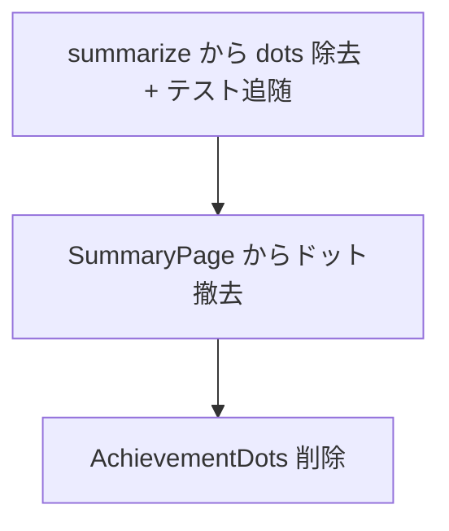

# streak-summary 変更計画書（達成日ドット表示の廃止）

> **入力**: `./001_REVISE_SPEC.md`, `src/features/streak-summary/SummaryPage.tsx`, `components.tsx`, `model/summarize.ts(.test.ts)`
> **最終更新**: 2026-06-13

---

## 1. 既存ファイル変更一覧

| ファイル | 変更内容（概要） | リスク | 関連 SPEC § |
|---|---|---|---|
| `src/features/streak-summary/SummaryPage.tsx` | `<AchievementDots dots={summary.dots}/>` 行と `AchievementDots` import を削除（`RateGauge` import は残す） | 低 | §2.2 |
| `src/features/streak-summary/components.tsx` | `AchievementDots` 関数と `Dot` import を削除（`RateGauge` は残す） | 低 | §2.2 |
| `src/features/streak-summary/model/summarize.ts` | `Summary` から `dots: Dot[]` を削除、return から `dots` を除去。内部の達成判定/連続日数算出は維持（`dots` は局所中間値として残すか同等ロジックに置換）。`Dot` の export は不要化（内部型に降格 or 削除） | 中 | §2.2, §7.2 |
| `src/features/streak-summary/model/summarize.test.ts` | `s.dots` を参照するアサーション（L55 付近）を削除し、`achievedDays`/`rate`/`currentStreak` での同等検証に置換 | 低 | §2.2 |

## 2. 新規ファイル一覧
| ファイル | 責務 | 依存 | LOC 見積 |
|---|---|---|---|
| （なし） | — | — | — |

## 3. 削除ファイル一覧
| ファイル | 削除理由 | 代替 |
|---|---|---|
| （ファイル単位の削除はなし） | `AchievementDots` は `components.tsx` 内の関数削除で対応 | RateGauge + 連続日数テキスト |

## 4. マイグレーション要否
- DB スキーマ変更: ❌ / 既存データ変換: ❌ / 設定ファイル変更: ❌ / ストレージパス変更: ❌
→ **マイグレーション不要**。

## 5. 実装 Phase 分割（`/flow:tdd` 連携）

### Phase 1 — モデルからの dots 除去（RED→GREEN→IMPROVE）
- 対象: `summarize.ts`, `summarize.test.ts`
- ゴール: `Summary` に `dots` が無く、`achievedDays`/`totalDays`/`currentStreak`/`rate` の算出が従来どおり green

### Phase 2 — UI からのドット撤去
- 対象: `SummaryPage.tsx`, `components.tsx`
- ゴール: 継続画面にドットが描画されず、率バー + 連続日数テキストが残る。`AchievementDots` への参照ゼロ（dead code なし）

## 6. 依存関係順序

## 7. ロールアウト計画
| ステップ | 内容 | 期日 | 検証方法 |
|---|---|---|---|
| 1 | 実装 + 単体 green | 2026-06-13 | vitest |
| 2 | `/flow:design` 視覚レビュー（ドット無し・縦並び崩れ解消） | 実装後 | headless スクショ |
| 3 | release バンドル同梱 | 次回 release | 実機目視 |

## 8. リスク・注意点
- `summarize` は `dots` を内部で達成判定に使っているため、return から外す際に achievedDays/streak の算出を壊さないこと（局所変数として残すのが安全）。
- `Dot` 型の export 削除で型エラーが出ないか（消費者は components.tsx のみ → 同時削除で解消）。

## 9. 完了の定義 (DoD)
- [ ] `Summary.dots` 削除、`summarize` 単体 green
- [ ] 継続画面にドットが出ない（視覚レビュー）
- [ ] `AchievementDots`/`Dot` への参照ゼロ（knip/grep）
- [ ] 既存 streak-summary テストが green
- [ ] `/flow:design` 視覚レビュー通過

## 10. 更新履歴
| 日付 | 変更概要 | 実行者 |
|---|---|---|
| 2026-06-13 | 初版作成 | /flow:revise |
